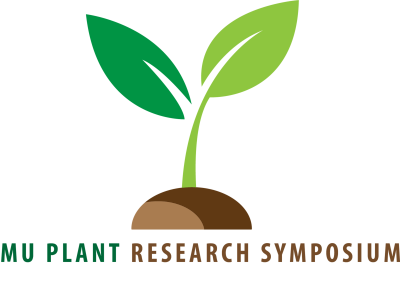

# Conference website

Website for the MU-Corteva Plant Research Symposium. Hosted freely in GitHub pages.

Website built with RMarkdown following [this tutorial](https://www.andreashandel.com/posts/2021-01-11-simple-github-website/index.html).

## 2025 Edition

- **Day:** Wednesday 9th, April 2025.
- **Time:** 8am - 5pm CT
- **Where:** MU Bond Life Sciences Center Building

### Invited Speakers

* Tessa Burch-Smith (Donald Danforth Plant Science Center)

* Malia Gehan (Donald Danforth Plant Science Center)

* Matthew B. Hufford (Iowa State University)

* Julin N. Maloof (University of California, Davis)

### Committee Members

* **Chair and fearless leader:** Sarah Fitzsimmons (Biological Sciences)

* **Co-chair and Treasurer:** Ha Ngoc Duong (Biological Sciences)

* **Secretary:** Lily Nowack (Biochemistry)

* **Treasurer:** Ha Duong (Plant Science & Technology)

* **Symposium Event Coordinator:** Prakriti Chand (Plant Science & Technology)

* **Social Event Coordinator:** Asha Kaluwella Mudalige (Biological Sciences)

* **Social Media Guru:** Grace Raycraft (Microbiology major)

* **Webmaster:** Erik Am&eacute;zquita (Plant Science/Mathematics)
  
* **Other:** Mandeep Kaur Jauhal (Plant Science & Technology), Nirmal Khadka (Plant Science & Technology), Nick Ice (Biochemistry), Monika Choudhary (Plant Science & Technology)
